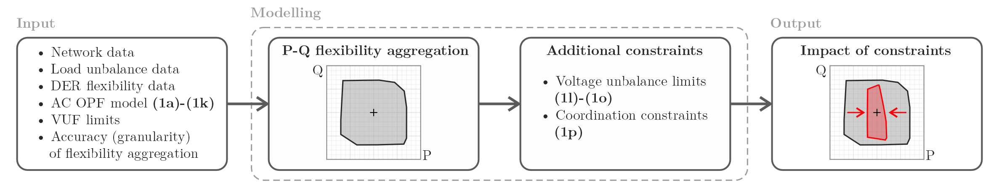
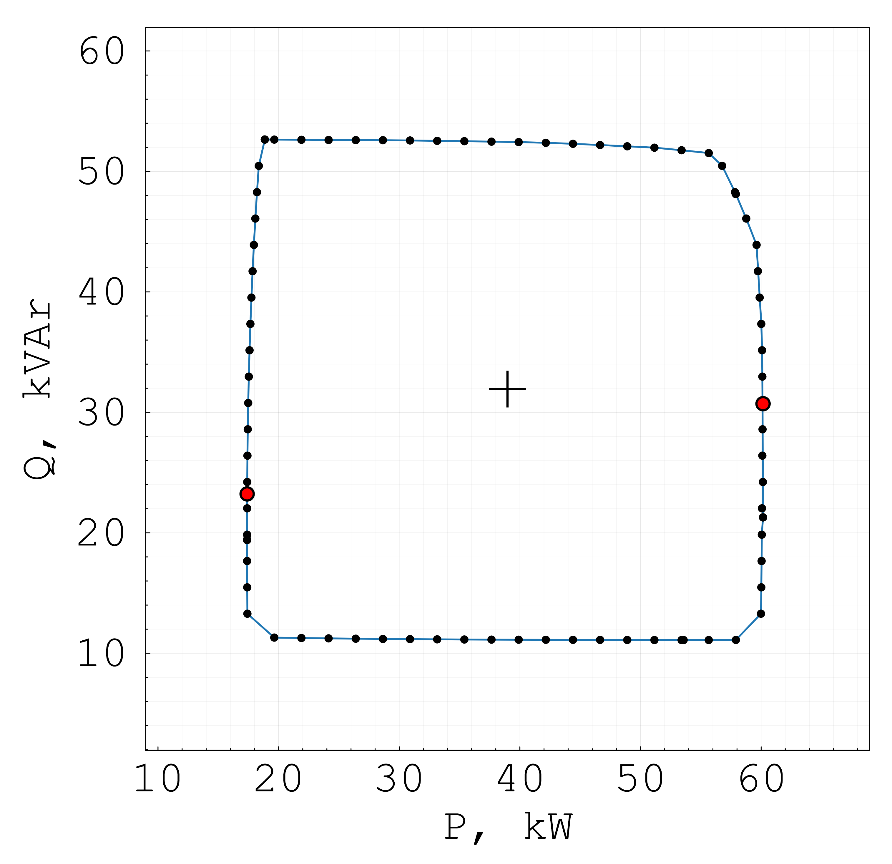
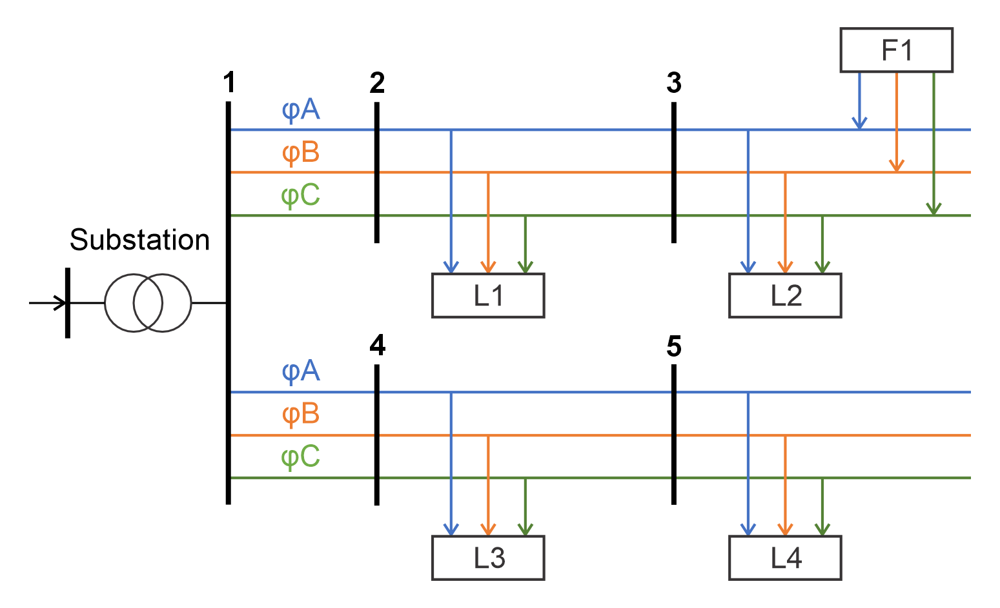
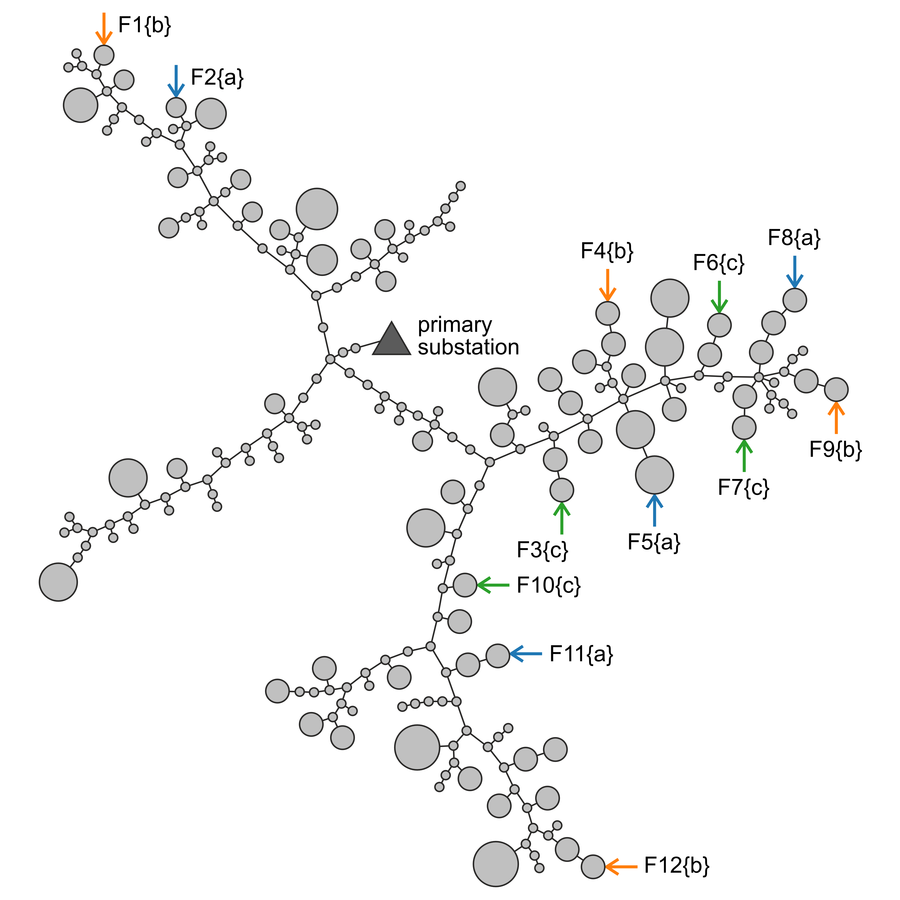
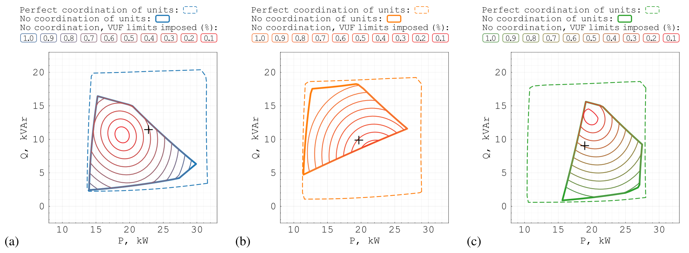
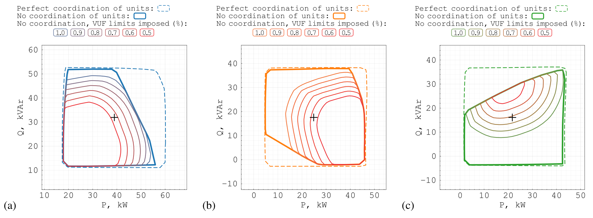

# 3FlexAnalyser.jl
**Julia tool for modelling and analysing flexibility in low voltage distribution networks, with nonlinear three-phase power flow and explicit constraints on voltage unbalance and phase coordination**

The tool enables quantifying the impacts of phase unbalance, voltage unbalance and distributed energy resources (DER) coordination on flexibility services in low voltage distribution networks.
The main idea of aggregated flexibility modelling in the unbalanced setting was originally formulated by Wangwei Kong (The University of Manchester → National Grid). The tool was further developed, tested and published by Andrey Churkin (The University of Manchester --> Imperial College London).

... don't forget to mention PowerModelsDistribution.jl ...

The tool has been tested in Julia v1.10.4 (2024-06-04) with the following packages:
- CSV v0.10.14
- ConcaveHull v1.1.0
- DataFrames v1.6.1
- Ipopt v1.6.3
- JLD v0.13.5
- JuMP v1.22.2
- LazySets v2.14.1
- Plots v1.40.4
- Polyhedra v0.7.8
- PowerModelsDistribution v0.15.2
- StatsPlots v0.15.7
- Suppressor v0.2.7

### REFERENCES:
[1] To be updated....
