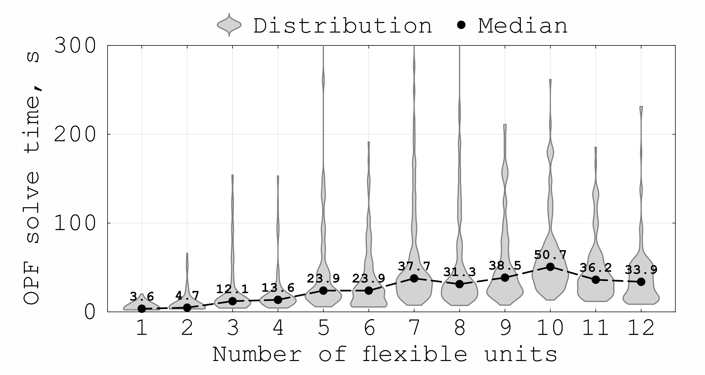
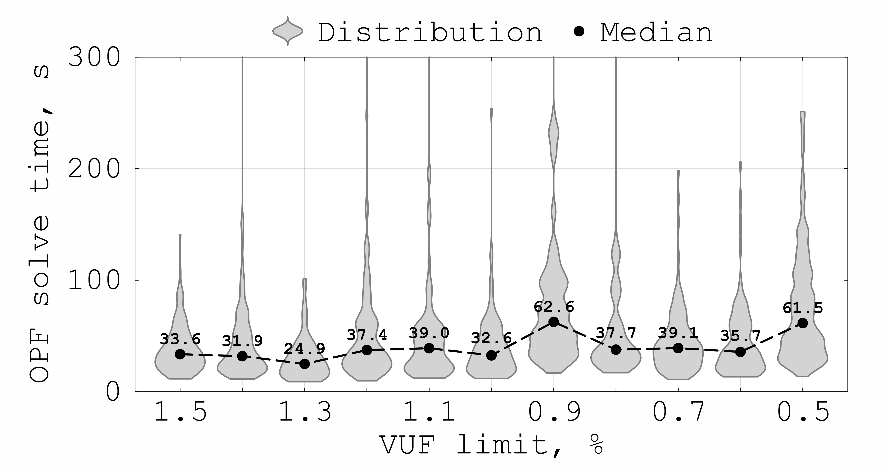

# Scalability Tests

This folder contains scripts for measuring how the computational time of the three-phase AC OPF model scales with respect to various problem parameters. All tests use the 221-bus real UK LV network `cases/221_bus_real_UK_case/`.

Each test solves the full P-Q flexibility area estimation algorithm (Q sweep + P sweep) in a loop and records the time of each individual OPF solve. Only converged OPFs (`LOCALLY_SOLVED` or `ALMOST_LOCALLY_SOLVED`) contribute to the timing statistics.

---

## Test scripts

| Script | What varies | Fixed parameters |
|--------|-------------|-----------------|
| `scalability_test_num_units.jl` | Number of flexible units (1 … 12, or up to 50 with the extended case) | VUF limit of 1.0% imposed at 7 constrained buses |
| `scalability_test_vuf_severity.jl` | VUF limit value (e.g. 0.5% … 2.0%) | All 12 units, 7 VUF-constrained buses |
| `scalability_test_constrained_locations.jl` | Number of VUF-constrained buses (1 … up to 54) | All 12 units, VUF limit 1.0% |

Each script has a **SIMULATION SETTINGS** block at the top where all parameters are configured. Long test runs can be split into chunks using the `_begin` / `_end` range parameters (e.g. `N_units_begin`, `n_locations_begin`). Partial results are accumulated without overwriting existing CSV files.

---

## Visualisation scripts

Each test has a companion visualisation script that reads the saved CSV and re-plots the violin chart without re-running any OPFs:

- `visualise_scalability_num_units.jl`
- `visualise_scalability_vuf_severity.jl`
- `visualise_scalability_constrained_locations.jl`

Set `csv_path` at the top of each script to point to the desired results file.

---

## Output

For each test, results are saved to `results/scalability_tests/` as 2 CSV files: 
1) `_all_times.csv` containing all raw data on OPF solve times, in seconds.
2) `_statistics.csv` providing summary statistics across all OPF solutions, e.g., mean, median, std, percentiles, convergence, in seconds.

Final plots are saved as `.png` and `.pdf` in the same `results/scalability_tests/` folder.

---

## Example

Scalability test with respect to the number of flexible units:

Scalability test with respect to the VUF constraint severity:

For a detailed discussion of these tests, see the recent version of the manuscript https://arxiv.org/abs/2408.06516
